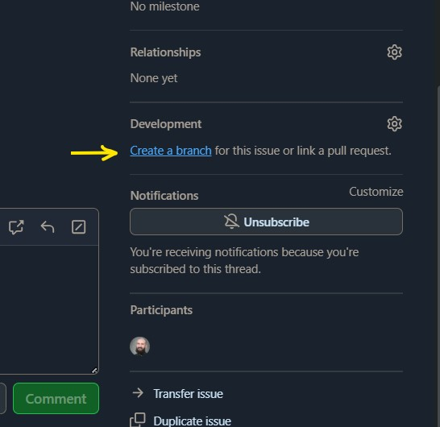

# Phaser Vite TypeScript Template

## Table Of Contents
- [How to Contribute](#how-to-contribute)
- [Template Project Structure](#template-project-structure)
- [Requirements](#requirements)
- [Available Commands](#available-commands)
- [Writing Code](#writing-code)
- [Linting and Code Style](#-linting-and-code-style)
- [Phaser Docs](#phaser-docs)

> This is a Phaser 3 project template that uses Vite for bundling. It supports hot-reloading for quick development workflow, w/ TypeScript support and scripts to generate production-ready builds. Forked from [https://github.com/phaserjs/template-webpack-ts] made by FrontEndParty for grab and go game jams.

## How to Contribute
- 🐷Install `Node.js` if you have not already. See [NODE](./docs/NODE.md) for 1st time help.
- 🐷Clone the Repo:
  - 🐖Copy this URL: https://github.com/FrontEndParty/pig-jam-2025.git
  - 🐖Run the following commands in the directory you want to download the repo:
```sh
git clone https://github.com/FrontEndParty/pig-jam-2025.git
```
- 🐷Navigate into the repo and install the dependencies:
```sh
cd pig-jam-2025
npm install
```
- 🐷Visit the [Project KanBan Board](https://github.com/orgs/FrontEndParty/projects/8)
- 🐷Pick an Issue to work on
  - 🐖Assign yourself as the "Assignee"
  - 🐖On the bottom right click "create a branch"<sup>1</sup>
    - 🐽Use the default values in the Dialog box
  - 🐖Move the Issue to the "Doing" column in the Project KanBan Board
- 🐷On your command line locally run the following:
```sh
git fetch origin
git checkout your-new-branch
```
- 🐷Develop :)

#### Screenshots
1.



## Template Project Structure
```
phase-game-template/
│
├── public/                 # Static files to be served (optional, for hosting)
|   ├── assets/                 # Static assets (images, audio, spritesheets, etc.)
│   │  ├── audio/
│   │  ├── fonts/
│   │  ├── images/
│   │  └── tilemaps/
│   └── style.css
│
└── src/                    # Source code
    ├── config/             # Game configuration files
    |
    ├── objects/            # Custom game objects or prefabs
    │
    ├── plugins/            # Game plugins
    │
    ├── scenes/             # All Phaser scenes (boot, preload, menu, game, etc.)
    │
    ├── systems/            # Logic systems like input, physics, or game state
    │
    ├── utils/              # Utility functions or constants
    │
    └── main.js             # Game entry point (new Phaser.Game)
```

## Requirements

[Node.js](https://nodejs.org) is required to install dependencies and run scripts via `npm`.

## Available Commands

| Command | Description |
|---------|-------------|
| `npm install` | Install project dependencies |
| `npm run dev` | Launch a development web server |
| `npm run build` | Create a production build in the `dist` folder |
| `npm run lint` | Run ESLint to check code (very relaxed rules for game jam) |

## Running the app
You can start the local development server by running `npm run dev`.

The local development server runs on `http://localhost:8080` by default.

Once the server is running you can edit any of the files in the `src` folder. Vite will automatically recompile your code and then reload the browser.

## Linting and Code Style

This project uses **very relaxed** linting rules optimized for rapid game jam development:

- **TypeScript** is configured with minimal strictness - only catching errors that would prevent compilation
- **ESLint** is configured with all style rules turned off - focus on shipping, not on perfect code
- **VSCode settings** are shared in the `.vscode` folder to provide a consistent experience

If you're using VSCode, we recommend installing the [ESLint extension](https://marketplace.visualstudio.com/items?itemName=dbaeumer.vscode-eslint). The shared settings will automatically configure it for you.

The philosophy: if it compiles and runs, it's good enough for a game jam! 🚀

## Phaser Docs

**Learn:** [API Docs](https://newdocs.phaser.io), [StackOverflow](https://stackoverflow.com/questions/tagged/phaser-framework)<br />
**Discord:** Join us on [Discord](https://discord.gg/phaser)<br />
**Code:** 2000+ [Examples](https://labs.phaser.io)<br />

Created by [Phaser Studio](mailto:support@phaser.io). Powered by coffee, anime, pixels and love.

The Phaser logo and characters are &copy; 2011 - 2024 Phaser Studio Inc.

All rights reserved.
